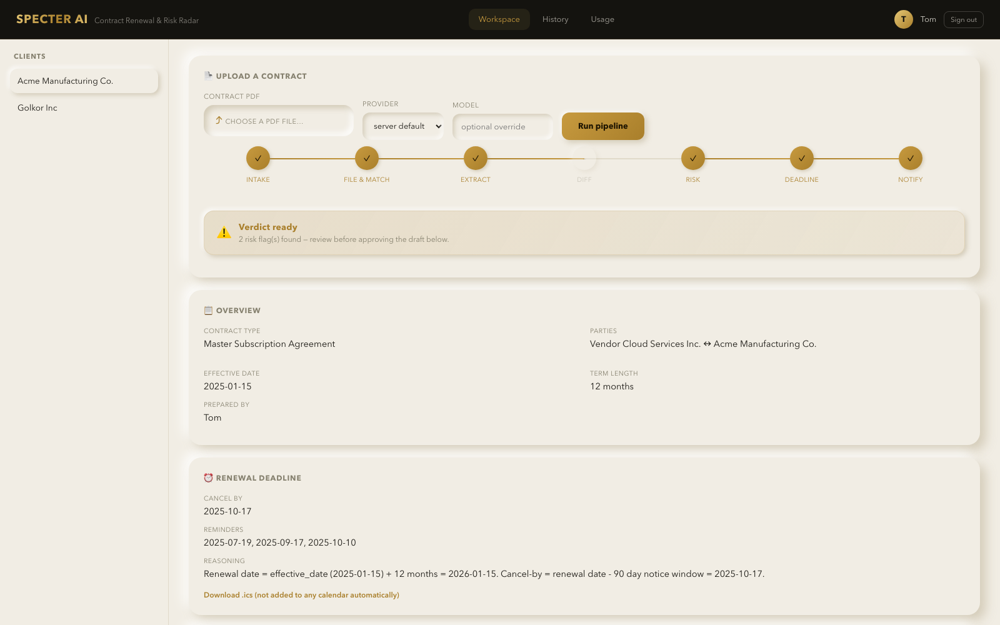
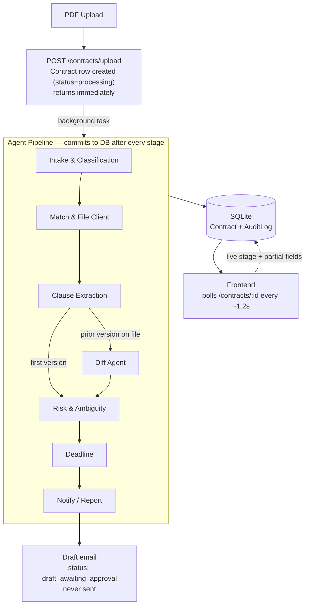
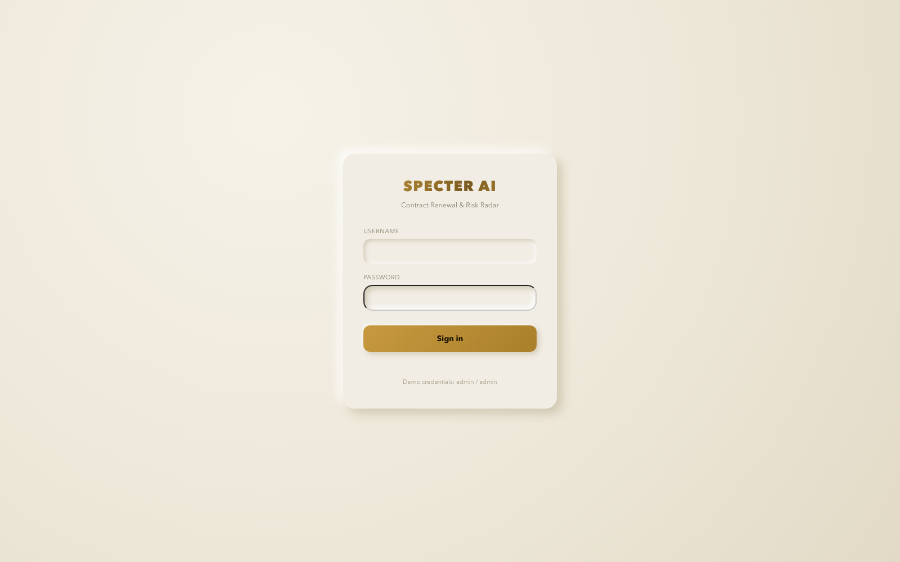
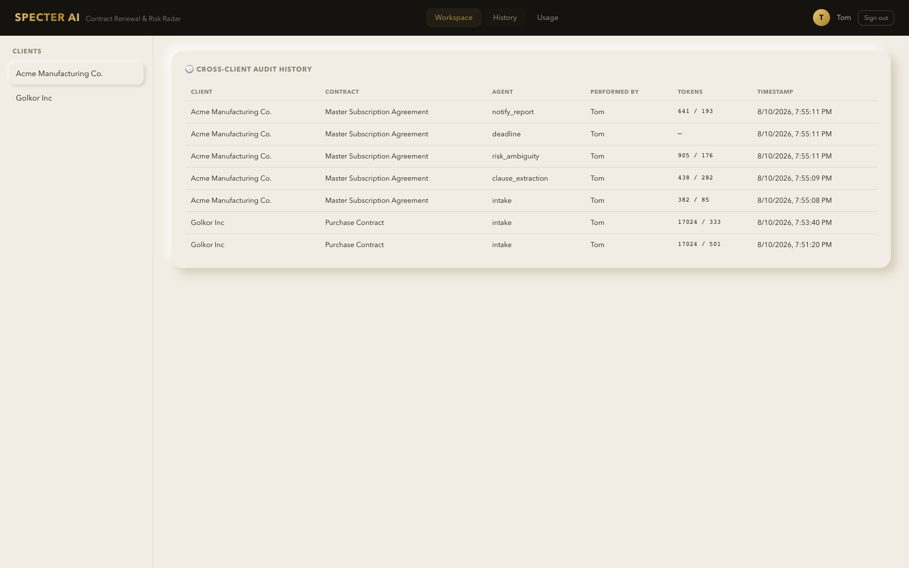
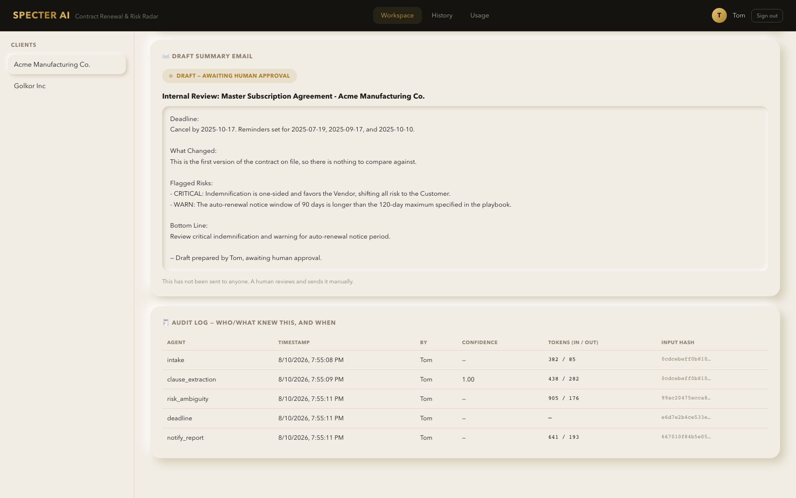
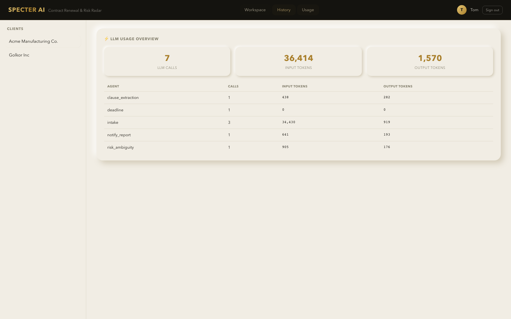

# Specter AI

**Contract Renewal & Risk Radar** — a multi-agent pipeline that reads a contract PDF, flags the clauses that actually cost money, computes the real cancel-by date, and drafts (never sends) a summary for a human to review.

Built around one thesis: most contract losses trace back to missed renewal windows and one-sided clauses nobody flagged in time — not to nobody reading the document. Specter AI targets that specific failure mode instead of trying to be a full clause-review platform.

<p align="center">
  
</p>

---

## Features

- **Six specialist agents, one dumb orchestrator.** Intake & Classification → Client Matching & Filing → Clause Extraction → Diff (only if a prior version exists) → Risk & Ambiguity → Deadline → Notify/Report. Each agent does one job and returns structured, typed output.
- **PDF-native ingestion.** Contracts arrive as PDFs — Specter AI extracts embedded text directly (`pypdf`), no manual copy-paste.
- **Resilient by design, not by accident.** Uploading returns instantly; the pipeline runs as a background job that commits progress to the database after *every single stage* — not just at the end. If a request dies mid-run, whatever already completed is safely on disk and visible in the UI, not lost.
- **A live pipeline stepper that isn't faked.** The "talking to the Risk agent…" caption you see is the frontend polling real backend stage transitions — not a canned animation timed to look plausible.
- **Human-in-the-loop, enforced in the architecture.** Nothing is ever auto-sent, auto-scheduled, or auto-approved. Every draft email is generated with `status: draft_awaiting_approval` and a visible badge; the `.ics` file is a download, never a calendar write.
- **Client matching & renewal detection.** Fuzzy-matches an uploaded contract to an existing client profile (or files a new one) and auto-detects when it's a renewal of a contract already on file, unlocking the Diff agent.
- **Playbook-driven risk flags.** A small, human-editable `playbook.json` defines acceptable fallback positions (liability caps, mutual indemnification, notice windows…); the Risk agent flags anything outside it, severity-scored.
- **Full audit trail.** Every agent call is logged — timestamp, SHA-256 input hash, full output, confidence, and real token usage — answering "who/what knew this, and when."
- **Cross-client history & usage dashboards.** A History tab spanning every client and contract, and a Usage tab totaling real LLM token spend per agent.
- **Provider-agnostic LLM gateway.** Switch between Anthropic (Claude) and Google (Gemini) per request, no code changes — useful for cost/quality tradeoffs or when a provider's free tier runs dry.
- **Minimal in-server auth.** A lightweight session system attributes every audit entry and draft to a named user.

## How it works



**Why this shape:** the orchestrator (LangGraph) is deliberately dumb — it just sequences agents and branches on one condition (does a prior contract version exist?). Each node is a specialist with a narrow job and typed, structured output. This is the same shape as a real LLM-gateway setup: a routing layer over specialized tool-calling agents.

**Resilience mechanic:** the pipeline is invoked with `.stream()`, not `.invoke()`. After every node finishes, its output is written to the owning `Contract` row and committed — so a dropped connection or a mid-process crash loses at most the *current* stage, never anything already completed. This was verified live: a Gemini quota error mid-run correctly left the contract `status: failed` with every already-completed field intact.

## Screenshots

| Login | Cross-client history |
|---|---|
|  |  |

| Audit log (per contract) | Usage overview |
|---|---|
|  |  |

## Tech stack

<p>
  
  
  
  
  
  
  
  
  
  
  
  
  
</p>

| Layer | Choice | Why |
|---|---|---|
| Orchestration | **LangGraph** | Graph-based routing that maps directly onto the agent pipeline — conditional branching (skip Diff when no prior version) without hand-rolled control flow |
| LLM calls | **Claude (Anthropic) or Gemini (Google)**, switchable per request | One gateway function (`app/llm_gateway.py`) resolves the active provider; agents never talk to a vendor SDK directly |
| Backend | **FastAPI** | Async, typed, background tasks for the resilient pipeline execution |
| Storage | **SQLite via SQLAlchemy** | Zero infra for a portfolio-scale project; `Contract` and `AuditLog` rows updated incrementally as the pipeline runs |
| PDF parsing | **pypdf** | Pure-Python embedded-text extraction, no system dependencies |
| Structured output | **Pydantic + LangChain's `with_structured_output`** | Every agent returns a typed schema, not a string to regex-parse |
| Frontend | **Vanilla HTML/CSS/JS, no build step** | Neumorphic gold/white/black theme; a single `fetch`-polling loop drives the live pipeline stepper |

## Getting started

```bash
git clone https://github.com/aqsaa-malikk99/specter-ai.git
cd specter-ai
python3 -m venv .venv && source .venv/bin/activate
pip install -r requirements.txt

cp .env.example .env
# edit .env: set ANTHROPIC_API_KEY and/or GOOGLE_API_KEY, and LLM_PROVIDER

uvicorn app.main:app --reload --port 8000
```

Open `http://127.0.0.1:8000/` and sign in with `admin` / `admin`.

## Project structure

```
app/
  agents/            # Intake, Extraction, Diff, Risk, Notify — typed schemas + prompts
  agents/deadline.py  # Deterministic date math (not an LLM call, on purpose)
  services/           # Client matching, renewal detection, playbook, audit, auth, PDF extraction
  graph.py             # LangGraph pipeline definition
  pipeline_runner.py   # Background execution + per-stage DB persistence
  llm_gateway.py        # Provider-agnostic LLM resolution + token-usage capture
  main.py                # FastAPI routes
  static/                 # Frontend (index.html, app.js, styles.css)
playbook.json          # Firm risk playbook — edit without touching code
```

## Human-in-the-loop, by design

Nothing in this system auto-emails a client, auto-books a date, or auto-writes to a live calendar. Every agent output is a *draft* or a *flag* — a person signs off before anything leaves the system. In a regulated environment, a silently-acting agent is a liability, not a feature.
